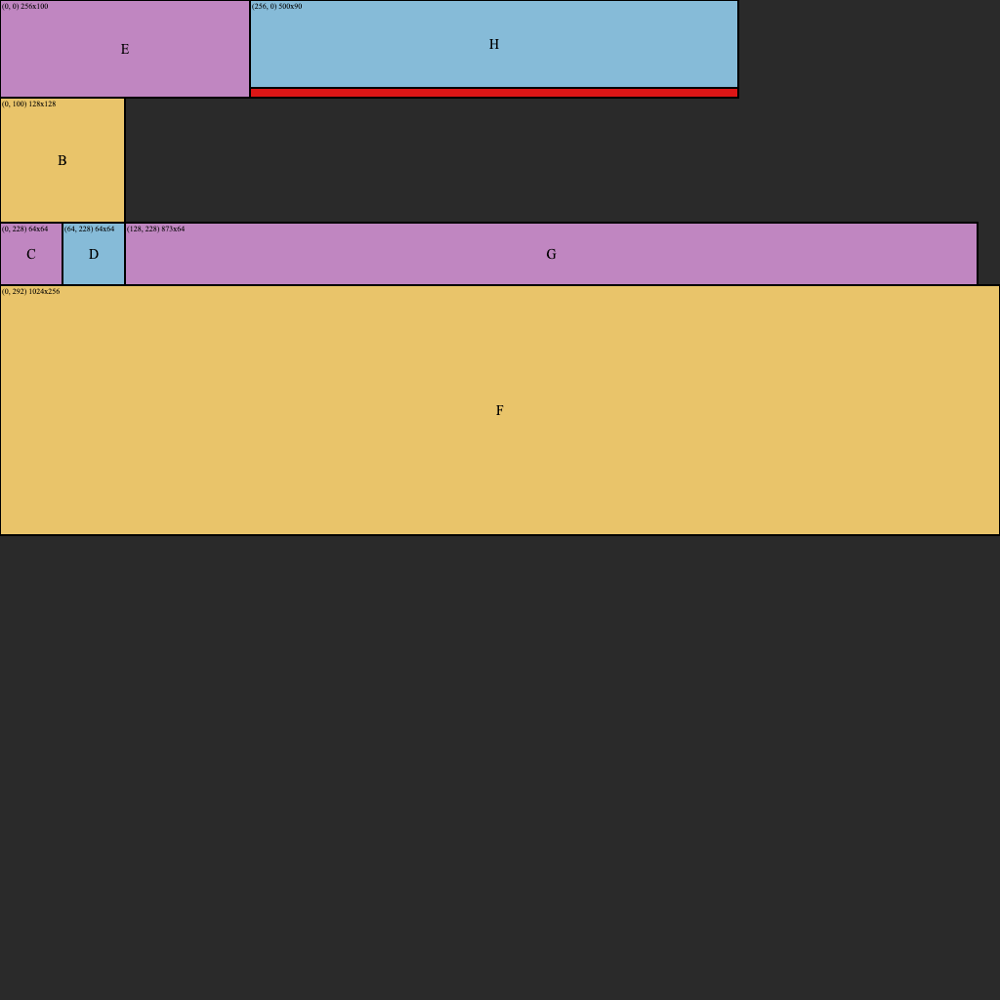

### Example

```zig
const std = @import("std");
const ShelfAllocator = @import("./main.zig").ShelfAllocator;

pub fn main() !void {
    var shelf = ShelfAllocator.init(std.heap.page_allocator, 1024, 1024, 0.9);
    defer shelf.deinit();

    const A = try shelf.allocateNamed(.{ .width = 100, .height = 100 }, "A");
    const B = try shelf.allocateNamed(.{ .width = 128, .height = 128 }, "B");

    std.debug.print("A @ {}\n", .{A.rectangle});
    std.debug.print("B @ {}\n", .{B.rectangle});

    shelf.free(A);

    _ = try shelf.allocateNamed(.{ .width = 64, .height = 64 }, "C");
    _ = try shelf.allocateNamed(.{ .width = 64, .height = 64 }, "D");
    _ = try shelf.allocateNamed(.{ .width = 256, .height = 100 }, "E");
    _ = try shelf.allocateNamed(.{ .width = 1024, .height = 256 }, "F");
    _ = try shelf.allocateNamed(.{ .width = 873, .height = 64 }, "G");

    // Because we set usage_threshold to 0.9 this will get allocated in the
    // same row as E, since it uses at least 90% of the shelf height.
    // However, it produces wasted space that is marked red in the output.
    _ = try shelf.allocateNamed(.{ .width = 500, .height = 90 }, "H");

    var stdout = std.io.getStdOut();
    try shelf.svgdump(stdout.writer(), .{
        .waste = true,
        .unused = false,
        .coords = true,
        .stroke = true,
        .names = true,
    });
}
```

Running this code writes the following SVG to stdout:


